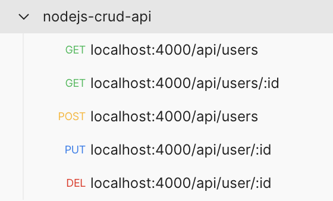

# Node.js CRUD API

## Description

This is CRUD (create, read, update, delete) API.

It uses in-memory database. It means that if you restart the process, all data will be lost.

## Tech requirements for starting the API

Please, [download](https://nodejs.org/en/download/) and install 18 LTS version of Node.js for using this API.

To check node version, type in a console:
```bash
node -v
```

## How to start the API

Clone this repository:

By SSH:
```bash
git clone git@github.com:hallovarvara/crud-api-nodejs.git
```

By HTTPS:
```bash
git clone https://github.com/hallovarvara/crud-api-nodejs.git
```

Enter the repo folder:
```bash
cd crud-api-nodejs
```

Install dependencies:
```bash
npm i
```

### Start in developer mode:

```bash
npm run start:dev
```

### Start in production mode:

```bash
npm run start:prod
```

### Start multi instances with a load balancer:

```bash
npm run start:multi
```

## Port for the application

You could specify what port to use in `.env` file, it's stored in root directory.

## How to use the API

For easy API testing you could use [Postman](https://www.postman.com/) by creating same requests collection:



## Endpoints

- **GET** `/api/users` is used to get all persons
  - Server will answer with `status code` **200** and all users records
- **GET** `/api/users/${userId}`
  - Server will answer with `status code` **200** and record with `id === userId` if it exists
  - Server will answer with `status code` **400** and corresponding message if `userId` is invalid (not `uuid`)
  - Server will answer with `status code` **404** and corresponding message if record with `id === userId` doesn't exist
- **POST** `/api/users` is used to create record about new user and store it in database
  - Server will answer with `status code` **201** and newly created record
  - Server will answer with `status code` **400** and corresponding message if request `body` does not contain **required** fields
- **PUT** `/api/users/{userId}` is used to update existing user
  - Server will answer with` status code` **200** and updated record
  - Server will answer with` status code` **400** and corresponding message if `userId` is invalid (not `uuid`)
  - Server will answer with` status code` **404** and corresponding message if record with `id === userId` doesn't exist
- **DELETE** `/api/users/${userId}` is used to delete existing user from database
  - Server will answer with `status code` **204** if the record is found and deleted
  - Server will answer with `status code` **400** and corresponding message if `userId` is invalid (not `uuid`)
  - Server will answer with `status code` **404** and corresponding message if record with `id === userId` doesn't exist

## Make sure using valid user id

User id is generated by server and could be taken from data, which is returned by `POST` (user creating) request. 
You don't need to pass `id` in `body` for this request, it will be ignored as all the fields that are not mentioned 
in this documentation.

It looks like this: `6f44911a-c556-4beb-a01e-308947018423` and has a basic format of `uuid` version 4.

## How users are stored

Users are stored as `objects` that have the following properties:
  - `id` — unique identifier (`string`, `uuid`) generated on server side
  - `username` — user's name (`string`, **required**)
  - `age` — user's age (`number`, **required**)
  - `hobbies` — user's hobbies (`array` of `strings` or empty `array`, **required**)

## Testing scenarios

For starting testing process type in the console:
```bash
npm run test
```

In a current implementation you don't need to start in parallel server. Test config will do it by itself.

Tests stored in `src/tests` directory from the root.
